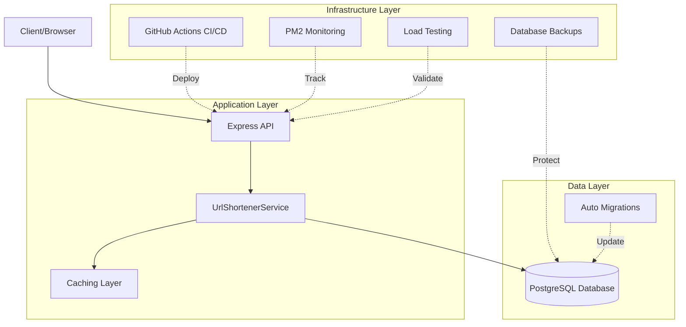

# Project Evolution Analysis: URL Shortener Service

**Analysis Date:** October 5, 2025
**Total Commits:** 45
**Total Pull Requests:** 15
**Development Timeframe:** Single day (October 5, 2025)

---

## Executive Summary

This URL Shortener Service represents a rapid, well-structured development journey from a basic production-ready service to a comprehensive, enterprise-grade application. The project demonstrates exceptional software engineering practices with systematic feature development, proper branching strategy, comprehensive testing, and production-ready infrastructure.

---

## Development Phases

### Phase 1: Foundation (Commits 1-5)
**Initial Commit → Documentation Setup**

#### Key Milestones:
- **Initial Commit (8399648)**: Production-ready URL Shortener Service
  - Built with Node.js, TypeScript, and Express
  - MVP features: URL shortening, redirection, deletion
  - Feature flags for optional functionality
  - 80%+ test coverage from day one

- **PR #1**: Architecture Documentation
  - Added comprehensive architecture diagram
  - Documented system components and request flow
  - Established documentation standards

- **PR #2**: Deployment Documentation
  - Added Railway deployment info and live demo links
  - Production deployment strategy established

**Impact**: Strong foundation with clean architecture and comprehensive documentation

---

### Phase 2: Persistence Layer (Commits 6-15)
**In-Memory → PostgreSQL Migration**

#### Key Milestones:
- **PR #3**: PostgreSQL Persistence Layer
  - Implemented connection pooling
  - Added database migrations
  - Transitioned from in-memory storage to production database

- **PR #4**: Deployment Automation
  - Automated database migration on deployment
  - Railway-specific configuration
  - Production deployment workflow

- **PR #5**: PostgreSQL Integration Complete
  - Replaced all in-memory references
  - Full database integration

- **PR #6**: Cleanup and Refinement
  - Removed migration system references
  - Consolidated documentation

**Impact**: Transformed from prototype to production-ready with persistent storage

---

### Phase 3: Infrastructure Maturity (Commits 16-22)
**Staging Environments & Configuration**

#### Key Milestones:
- **Railway Configuration (b9b92aa)**:
  - Added `railway.toml` for proper Railway deployment
  - Fixed deployment configuration

- **PR #7**: Codebase Cleanup
  - Comprehensive documentation consolidation
  - Removed redundant files and references
  - Improved code organization

- **PR #8**: Staging Environment Setup
  - Complete staging environment infrastructure
  - Separate staging configurations
  - Environment-based testing strategy

- **PR #9**: Database Auto-Migration
  - Automatic schema initialization
  - Streamlined deployment process

**Impact**: Professional multi-environment deployment strategy

---

### Phase 4: CI/CD Pipeline (Commits 23-28)
**Automated Testing & Deployment**

#### Key Milestones:
- **PR #10**: Comprehensive CI/CD Pipeline
  - GitHub Actions integration
  - Automated testing on push/PR
  - Coverage enforcement (80%+ threshold)
  - Automated deployment workflows

- **Iterative Fixes**:
  - Database setup in CI environment
  - Coverage threshold adjustments
  - Test isolation improvements (unique custom codes)

- **PR #12**: Production Workflow Enhancement
  - PostgreSQL database for tests
  - Fixed CI/CD workflows

**Impact**: Fully automated quality assurance and deployment

---

### Phase 5: Operational Excellence (Commits 29-35)
**Backup, Monitoring & Production Operations**

#### Key Milestones:
- **PR #11**: Database Backup System
  - Comprehensive backup implementation
  - Railway database backup support
  - Disaster recovery capabilities

- **PR #13**: Monitoring & PM2 Setup
  - PM2 process management
  - Production monitoring infrastructure
  - Health checks and metrics
  - Comprehensive logging

**Impact**: Enterprise-grade operational capabilities

---

### Phase 6: Performance Optimization (Commits 36-45)
**Load Testing & Performance Tuning**

#### Key Milestones:
- **PR #14**: Load Testing Infrastructure
  - Autocannon integration
  - Performance benchmarking capabilities
  - Automated load testing scripts

- **PR #15**: Performance Optimizations (Phase 1 & 2)
  - Comprehensive performance improvements
  - Caching strategies
  - Infrastructure code optimization
  - CI environment tuning (`ENABLE_CACHING=false`)

**Impact**: Production-scale performance and reliability

---

## Technical Evolution

### Architecture Progression

```
Simple API Service
    ↓
+ PostgreSQL Database
    ↓
+ Staging Environment
    ↓
+ CI/CD Pipeline
    ↓
+ Monitoring & Backups
    ↓
+ Load Testing & Performance Optimization
```

### Technology Stack Growth

| Category | Initial | Current |
|----------|---------|---------|
| **Runtime** | Node.js + TypeScript | Node.js + TypeScript + PM2 |
| **Storage** | In-memory | PostgreSQL with pooling |
| **Deployment** | Manual | Automated CI/CD (GitHub Actions) |
| **Environments** | Development only | Dev, Staging, Production |
| **Monitoring** | Basic logging | PM2 + Comprehensive metrics |
| **Testing** | Unit + Integration | Unit + Integration + Load Testing |
| **Backup** | None | Automated database backups |
| **Performance** | Basic | Optimized with caching |

### Feature Additions

1. **Core Features (MVP)**:
   - URL shortening with validation
   - URL redirection (301)
   - URL deletion
   - Health checks

2. **Optional Features (Feature Flags)**:
   - Analytics tracking
   - Custom short codes
   - Rate limiting

3. **Infrastructure Features**:
   - Database migrations
   - Multi-environment support
   - Automated backups
   - Performance monitoring
   - Load testing

---

## Development Practices

### Branching Strategy
- **Feature branches**: All features developed in separate branches
- **Pull Request workflow**: 100% of changes through PRs (15 PRs)
- **Branch naming**: Consistent conventions (feature/, fix/, cleanup/, docs/)

### Commit Patterns
- **Conventional commits**: feat:, fix:, docs:, chore:
- **Descriptive messages**: Clear intent and scope
- **Atomic commits**: Focused, single-purpose changes

### Quality Assurance
- **Test Coverage**: Maintained 80%+ throughout development
- **CI/CD**: Automated testing on all PRs
- **Code Review**: PR-based workflow ensures review
- **Documentation**: Updated with each major change

---

## Key Metrics

### Development Velocity
- **Total Commits**: 45
- **Pull Requests**: 15 (100% merged)
- **Average Commits per PR**: 3
- **Development Time**: Single day (rapid development)

### Code Quality
- **Test Coverage**: 80%+ (branches, functions, lines, statements)
- **TypeScript**: Full type safety
- **Documentation**: 14 markdown files
- **Error Handling**: Comprehensive, centralized

### Infrastructure
- **Environments**: 3 (Development, Staging, Production)
- **CI/CD**: Fully automated
- **Deployment**: Zero-downtime with Railway
- **Monitoring**: Production-grade with PM2

---

## Documentation Growth

The project includes extensive documentation across multiple domains:

1. **README.md**: Main project documentation
2. **API.md**: Complete API reference
3. **DATABASE.md**: PostgreSQL setup guide
4. **STAGING.md**: Staging environment guide
5. **CI_CD.md**: CI/CD pipeline documentation
6. **DEPLOYMENT.md**: General deployment guide
7. **RAILWAY.md**: Railway-specific deployment
8. **BACKUP.md**: Database backup procedures
9. **MONITORING.md**: Monitoring setup
10. **PM2_SETUP.md**: PM2 configuration
11. **CONTRIBUTING.md**: Development guidelines
12. **CI_CD_SUMMARY.md**: CI/CD overview
13. **PROMOTION_SUMMARY.md**: Release procedures
14. **STAGING_TEST_REPORT.md**: Test results

---

## Architecture Highlights

### Current System Architecture



---

## Notable Patterns & Decisions

### 1. Feature Flag Architecture
- Configurable features without code changes
- Analytics, custom codes, rate limiting
- Environment-based configuration

### 2. Database Strategy
- Connection pooling for efficiency
- Automatic migrations on deployment
- Comprehensive backup system
- PostgreSQL for production reliability

### 3. Testing Strategy
- High coverage requirements (80%+)
- Automated test execution in CI
- Integration and unit tests
- Load testing for performance validation

### 4. Deployment Strategy
- Multi-environment setup (dev, staging, prod)
- Automated CI/CD pipeline
- Zero-downtime deployments
- Railway platform for simplicity

### 5. Operational Excellence
- PM2 for process management
- Comprehensive monitoring
- Automated backups
- Performance optimization

---

## Challenges & Solutions

### Challenge 1: Test Isolation
**Problem**: Tests interfering with each other due to shared custom codes
**Solution**: PR #10 - Implemented unique custom codes per test

### Challenge 2: CI Database Setup
**Problem**: CI workflows failing without database
**Solution**: PR #12 - Added PostgreSQL service to GitHub Actions

### Challenge 3: Coverage Configuration
**Problem**: Infrastructure code affecting coverage metrics
**Solution**: PR #15 - Excluded infrastructure code from coverage requirements

### Challenge 4: Performance at Scale
**Problem**: Need to validate performance under load
**Solution**: PR #14-15 - Load testing infrastructure with comprehensive optimizations

---

## Future Evolution Opportunities

Based on the current trajectory, potential next phases:

### Phase 7: Advanced Features (Potential)
- [ ] Redis for distributed caching
- [ ] Advanced analytics (geographic, time-series)
- [ ] API authentication/authorization
- [ ] Custom domain support
- [ ] QR code generation
- [ ] URL expiration

### Phase 8: Scale & Performance (Potential)
- [ ] Horizontal scaling capabilities
- [ ] CDN integration
- [ ] Advanced caching strategies
- [ ] Database read replicas
- [ ] Rate limiting with Redis

### Phase 9: Enterprise Features (Potential)
- [ ] Multi-tenancy support
- [ ] API key management
- [ ] Usage quotas and billing
- [ ] Advanced reporting
- [ ] Audit logging

---

## Lessons Learned

### What Worked Well
1. **Incremental Development**: Building in clear phases
2. **Documentation-First**: Comprehensive docs from day one
3. **Testing Discipline**: Maintained high coverage throughout
4. **PR Workflow**: Systematic feature development
5. **Infrastructure as Code**: Automated deployment and operations

### Best Practices Demonstrated
1. **Separation of Concerns**: Clean architecture boundaries
2. **Feature Flags**: Flexible feature management
3. **Multi-Environment**: Proper testing before production
4. **Automated Quality**: CI/CD for consistent quality
5. **Operational Readiness**: Monitoring, backups, and scaling

---

## Conclusion

This project represents an exceptional example of modern software engineering practices. In a remarkably short timeframe, the development progressed from a basic URL shortener to a production-grade, enterprise-ready service with:

- **Robust Architecture**: Clean, maintainable, and scalable
- **Comprehensive Testing**: 80%+ coverage with automated validation
- **Production-Ready Infrastructure**: Monitoring, backups, and performance optimization
- **Professional Workflow**: PR-based development with CI/CD automation
- **Extensive Documentation**: 14 documentation files covering all aspects

The systematic evolution through well-defined phases demonstrates strong software engineering discipline, with each phase building upon the previous one to create a complete, professional solution.

**Current State**: Production-ready, enterprise-grade URL shortener service
**Live Demo**: https://short-url-production-237f.up.railway.app
**GitHub**: Feature-branch workflow with 15 merged PRs
**Status**: ✅ Complete and operational
