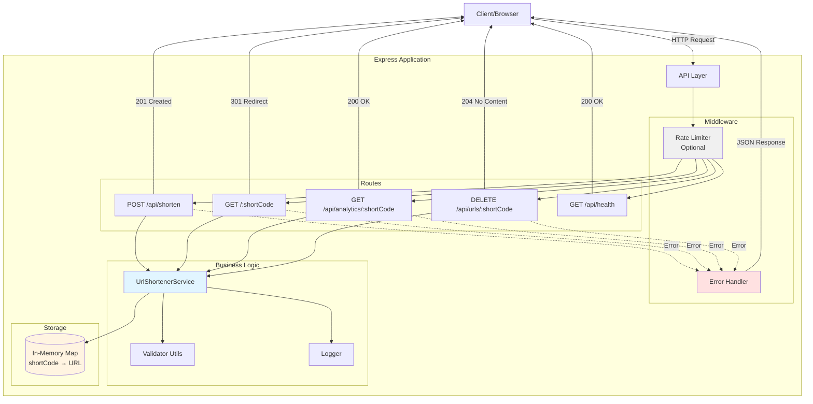

# URL Shortener Service

[](https://short-url-production-237f.up.railway.app)
[](https://railway.app)
[](https://www.typescriptlang.org/)
[]()

A production-ready URL shortener service built with Node.js, TypeScript, and Express. Features clean, readable code with comprehensive tests and optional enhancements controlled by feature flags.

**🚀 Live Demo:** [https://short-url-production-237f.up.railway.app](https://short-url-production-237f.up.railway.app)

## Features

### MVP Features ✅
- **URL Shortening**: Convert long URLs into short, shareable links
- **URL Redirection**: Redirect short codes to original URLs
- **URL Management**: Delete shortened URLs
- **Validation**: Comprehensive URL and input validation
- **Error Handling**: Robust error handling with meaningful messages
- **Health Checks**: Monitor service health and status
- **Logging**: Production-ready logging with timestamps
- **Testing**: 80%+ code coverage with unit and integration tests

### Optional Features (Feature Flags) 🚩
- **Analytics** (`ENABLE_ANALYTICS`): Track access counts and timestamps
- **Custom Short Codes** (`ENABLE_CUSTOM_CODES`): Allow users to specify custom short codes
- **Rate Limiting** (`ENABLE_RATE_LIMITING`): Prevent abuse with configurable rate limits

## Architecture



### Component Overview

| Component | Description |
|-----------|-------------|
| **API Layer** | Express server handling HTTP requests |
| **Rate Limiter** | Optional middleware for request throttling (feature flag) |
| **Routes** | Endpoint handlers for URL operations |
| **UrlShortenerService** | Core business logic for URL shortening |
| **Validator** | Input validation and sanitization |
| **Logger** | Structured logging for monitoring |
| **Storage** | In-memory Map (replace with Redis/DB for production) |
| **Error Handler** | Centralized error handling and formatting |

### Request Flow

1. **Create Short URL**: `Client → Rate Limiter → /api/shorten → Service → Storage → Response`
2. **Redirect**: `Client → /:shortCode → Service → Storage → 301 Redirect`
3. **Analytics**: `Client → /api/analytics/:code → Service → Storage → Analytics Data`
4. **Delete**: `Client → DELETE /api/urls/:code → Service → Storage → 204 Response`

## Quick Start

### Prerequisites
- Node.js 18+
- npm or yarn

### Installation

1. Clone the repository:
```bash
git clone <repository-url>
cd url-shorter
```

2. Install dependencies:
```bash
npm install
```

3. Configure environment variables:
```bash
cp .env.example .env
```

Edit `.env` to configure your settings:
```env
PORT=3000
BASE_URL=http://localhost:3000

# Feature Flags
ENABLE_ANALYTICS=false
ENABLE_CUSTOM_CODES=false
ENABLE_RATE_LIMITING=false
```

4. Run the development server:
```bash
npm run dev
```

The service will be available at `http://localhost:3000`

## Usage

### API Endpoints

#### 1. Create Short URL
**POST** `/api/shorten`

Create a shortened URL from a long URL.

**Request Body:**
```json
{
  "url": "https://www.example.com/very/long/url",
  "customCode": "mylink"  // Optional, requires ENABLE_CUSTOM_CODES=true
}
```

**Response (201 Created):**
```json
{
  "shortCode": "abc123",
  "originalUrl": "https://www.example.com/very/long/url",
  "shortUrl": "http://localhost:3000/abc123",
  "createdAt": "2025-10-05T12:00:00.000Z"
}
```

**Example:**
```bash
curl -X POST http://localhost:3000/api/shorten \
  -H "Content-Type: application/json" \
  -d '{"url": "https://github.com"}'
```

#### 2. Redirect to Original URL
**GET** `/:shortCode`

Redirects to the original URL. Returns 301 (Permanent Redirect).

**Example:**
```bash
curl -L http://localhost:3000/abc123
# Redirects to the original URL
```

#### 3. Get Analytics (Optional)
**GET** `/api/analytics/:shortCode`

Get analytics data for a short URL. Requires `ENABLE_ANALYTICS=true`.

**Response (200 OK):**
```json
{
  "shortCode": "abc123",
  "originalUrl": "https://www.example.com",
  "accessCount": 42,
  "createdAt": "2025-10-05T12:00:00.000Z",
  "lastAccessedAt": "2025-10-05T14:30:00.000Z"
}
```

**Example:**
```bash
curl http://localhost:3000/api/analytics/abc123
```

#### 4. Delete Short URL
**DELETE** `/api/urls/:shortCode`

Deletes a shortened URL.

**Response:** 204 No Content

**Example:**
```bash
curl -X DELETE http://localhost:3000/api/urls/abc123
```

#### 5. Health Check
**GET** `/api/health`

Check service health and status.

**Response (200 OK):**
```json
{
  "status": "healthy",
  "timestamp": "2025-10-05T12:00:00.000Z",
  "urlCount": 10,
  "features": {
    "analytics": false,
    "customCodes": false,
    "rateLimiting": false
  }
}
```

### Error Responses

All errors follow a consistent format:

```json
{
  "error": "Error message",
  "statusCode": 400,
  "details": "Additional details if available"
}
```

Common error codes:
- `400` - Bad Request (invalid input)
- `403` - Forbidden (feature not enabled)
- `404` - Not Found (short code doesn't exist)
- `409` - Conflict (custom code already exists)
- `429` - Too Many Requests (rate limit exceeded)
- `500` - Internal Server Error

## Development

### Available Scripts

```bash
# Development server with auto-reload
npm run dev

# Build for production
npm run build

# Start production server
npm start

# Run tests
npm test

# Run tests in watch mode
npm run test:watch

# Run tests with coverage
npm run test:coverage
```

### Project Structure

```
url-shorter/
├── src/
│   ├── __tests__/          # Integration tests
│   ├── middleware/         # Express middleware
│   │   ├── errorHandler.ts
│   │   └── rateLimiter.ts
│   ├── routes/             # API routes
│   │   └── urlRoutes.ts
│   ├── services/           # Business logic
│   │   ├── __tests__/
│   │   └── UrlShortenerService.ts
│   ├── types/              # TypeScript types
│   │   └── index.ts
│   ├── utils/              # Utilities
│   │   ├── __tests__/
│   │   ├── config.ts
│   │   ├── logger.ts
│   │   └── validator.ts
│   ├── app.ts              # Express app setup
│   └── index.ts            # Entry point
├── .env.example            # Example environment variables
├── .gitignore
├── jest.config.js          # Jest configuration
├── nodemon.json            # Nodemon configuration
├── package.json
├── tsconfig.json           # TypeScript configuration
└── README.md
```

### Running Tests

```bash
# Run all tests
npm test

# Run with coverage report
npm run test:coverage

# Run in watch mode for development
npm run test:watch
```

Test coverage targets:
- Branches: 80%
- Functions: 80%
- Lines: 80%
- Statements: 80%

### Building for Production

```bash
# Compile TypeScript to JavaScript
npm run build

# Run the compiled code
npm start
```

The compiled code will be in the `dist/` directory.

## Configuration

### Environment Variables

| Variable | Default | Description |
|----------|---------|-------------|
| `PORT` | `3000` | Server port |
| `NODE_ENV` | `development` | Environment (development/production) |
| `BASE_URL` | `http://localhost:3000` | Base URL for shortened links |
| `ENABLE_ANALYTICS` | `false` | Enable access tracking |
| `ENABLE_CUSTOM_CODES` | `false` | Allow custom short codes |
| `ENABLE_RATE_LIMITING` | `false` | Enable rate limiting |
| `RATE_LIMIT_WINDOW_MS` | `900000` | Rate limit window (15 minutes) |
| `RATE_LIMIT_MAX_REQUESTS` | `100` | Max requests per window |

### Feature Flags

#### Analytics
When enabled, tracks:
- Number of times each short URL is accessed
- Last access timestamp
- Provides analytics endpoint

```env
ENABLE_ANALYTICS=true
```

#### Custom Short Codes
When enabled, allows users to specify their own short codes:

```bash
curl -X POST http://localhost:3000/api/shorten \
  -H "Content-Type: application/json" \
  -d '{"url": "https://github.com", "customCode": "gh"}'
```

```env
ENABLE_CUSTOM_CODES=true
```

#### Rate Limiting
When enabled, limits the number of requests per IP address:

```env
ENABLE_RATE_LIMITING=true
RATE_LIMIT_WINDOW_MS=900000  # 15 minutes
RATE_LIMIT_MAX_REQUESTS=100  # 100 requests per window
```

## Production Deployment

### Docker

A `Dockerfile` and `docker-compose.yml` are provided for easy deployment:

```bash
# Build and run with Docker Compose
docker-compose up -d

# Or build manually
docker build -t url-shortener .
docker run -p 3000:3000 --env-file .env url-shortener
```

### Manual Deployment

1. Set `NODE_ENV=production`
2. Configure your `BASE_URL` to your domain
3. Build the application: `npm run build`
4. Start the server: `npm start`
5. Use a process manager like PM2 for production:

```bash
npm install -g pm2
pm2 start dist/index.js --name url-shortener
```

### Considerations for Production

- **Database**: Replace in-memory storage with Redis or a database (PostgreSQL, MongoDB)
- **Distributed Systems**: Use Redis for distributed rate limiting across multiple instances
- **Monitoring**: Add APM tools (New Relic, DataDog)
- **Logging**: Use structured logging with services like ELK stack or CloudWatch
- **HTTPS**: Always use HTTPS in production
- **Authentication**: Add API authentication for create/delete operations
- **Analytics**: Consider using a proper analytics database for better insights

## Architecture

### Core Components

1. **UrlShortenerService**: Core business logic for creating and managing short URLs
2. **Express App**: REST API with middleware for error handling, validation, and rate limiting
3. **Validators**: Input validation and sanitization
4. **Logger**: Structured logging for monitoring and debugging
5. **Configuration**: Environment-based configuration with feature flags

### Design Decisions

- **In-Memory Storage**: Simple MVP uses a Map. Replace with Redis/database for production.
- **Feature Flags**: Enable/disable features without code changes
- **TypeScript**: Type safety and better developer experience
- **Separation of Concerns**: Services, routes, middleware, and utilities are clearly separated
- **Error Handling**: Centralized error handling with consistent error responses
- **Testing**: High test coverage for reliability

## License

ISC

## Contributing

1. Fork the repository
2. Create a feature branch (`git checkout -b feature/amazing-feature`)
3. Commit your changes (`git commit -m 'Add amazing feature'`)
4. Push to the branch (`git push origin feature/amazing-feature`)
5. Open a Pull Request

## Support

For issues and questions, please open an issue on GitHub.
